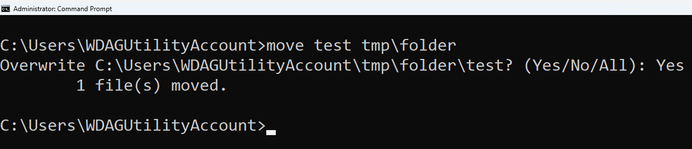

Antes de Empezar
---
<!-- pause -->
```console
           ⡴⠑⡄⠀⠀⠀⠀⠀⠀⠀ ⣀⣀⣤⣤⣤⣀⡀
           ⠸⡇⠀⠿⡀⠀⠀⠀⣀⡴⢿⣿⣿⣿⣿⣿⣿⣿⣷⣦⡀
           ⠀⠀⠀⠀⠑⢄⣠⠾⠁⣀⣄⡈⠙⣿⣿⣿⣿⣿⣿⣿⣿⣆
           ⠀⠀⠀⠀⢀⡀⠁⠀⠀⠈⠙⠛⠂⠈⣿⣿⣿⣿⣿⠿⡿⢿⣆
           ⠀⠀⠀⢀⡾⣁⣀⠀⠴⠂⠙⣗⡀⠀⢻⣿⣿⠭⢤⣴⣦⣤⣹⠀⠀⠀⢀⢴⣶⣆
           ⠀⠀⢀⣾⣿⣿⣿⣷⣮⣽⣾⣿⣥⣴⣿⣿⡿⢂⠔⢚⡿⢿⣿⣦⣴⣾⠸⣼⡿
           ⠀⢀⡞⠁⠙⠻⠿⠟⠉⠀⠛⢹⣿⣿⣿⣿⣿⣌⢤⣼⣿⣾⣿⡟⠉
           ⠀⣾⣷⣶⠇⠀⠀⣤⣄⣀⡀⠈⠻⣿⣿⣿⣿⣿⣿⣿⣿⣿⣿⡇
           ⠀⠉⠈⠉⠀⠀⢦⡈⢻⣿⣿⣿⣶⣶⣶⣶⣤⣽⡹⣿⣿⣿⣿⡇
           ⠀⠀⠀⠀⠀⠀⠀⠉⠲⣽⡻⢿⣿⣿⣿⣿⣿⣿⣷⣜⣿⣿⣿⡇
           ⠀⠀ ⠀⠀⠀⠀⠀⢸⣿⣿⣷⣶⣮⣭⣽⣿⣿⣿⣿⣿⣿⣿⠇
           ⠀⠀⠀⠀⠀⠀⣀⣀⣈⣿⣿⣿⣿⣿⣿⣿⣿⣿⣿⣿⣿⣿⠇
           ⠀⠀⠀⠀⠀⠀⢿⣿⣿⣿⣿⣿⣿⣿⣿⣿⣿⣿⣿⣿⣿⠃
```
<!-- pause -->
Hola, soy Jorge Thomas y esta es mi presentación "Domina la Terminal"
<!-- pause -->
# ¿Que haremos hoy?
<!-- pause -->
* ¿Qué es la terminal, consola, shell y la linea de comandos?
<!-- pause -->
* ¿Por qué es importante aprender a usar la terminal?
<!-- pause -->
* Ejercicios prácticos para aprender a usar la terminal.
<!-- pause -->
* Impresionar a tus amigos con tu conocimiento de la terminal.
<!-- pause -->
* Juegos Interactivos para aprender sobre la terminal y programación.
<!-- pause -->
# ¿Qué necesitas?
* Una terminal (Windows: cmd, macOS: Terminal, Linux: Terminal) o un navegador web.
* Saber escribir.
* Ganas de aprender.
<!-- end_slide -->

Terminal, Consola, Shell y Línea de Comandos
---
<!-- column_layout: [2, 1] -->
<!-- column: 0 -->
# Consola:
Dispositivo físico o virtual para interacción. Ejemplos: Símbolo del sistema, PowerShell.
_También se usa de manera intercambiable con "terminal", pero a veces se asocia más específicamente con la interfaz que aparece al arrancar el sistema, antes de iniciar un entorno gráfico._
<!-- column: 1 -->

<!-- pause -->
<!-- reset_layout -->
<!-- column_layout: [2, 1] -->
<!-- column: 0 -->
# Terminal: 
Interfaz textuada para ejecutar comandos. Ejemplos: GNOME Terminal, macOS Terminal.
_Básicamente, es una ventana o un programa en el que puedes abrir y ejecutar sesiones de shell._
<!-- column: 1 -->

<!-- reset_layout -->
<!-- pause -->
<!-- column_layout: [2, 1] -->
<!-- column: 0 -->
# Shell: 
Intérprete de comandos que ejecuta y interpreta. Ejemplos: Bash, Zsh.
# Línea de Comandos:
Interfaz para ingresar comandos y recibir salida. Ejemplos: Comandos en cmd.exe, PowerShell.

_**Nota:** Todos son interfaces basadas en texto sin gráficos._
<!-- column: 1 -->


<!-- end_slide -->
¿Y a mi que me importa esto?
---
```console
           ⣞⢽⢪⢣⢣⢣⢫⡺⡵⣝⡮⣗⢷⢽⢽⢽⣮⡷⡽⣜⣜⢮⢺⣜⢷⢽⢝⡽⣝
          ⠸⡸⠜⠕⠕⠁⢁⢇⢏⢽⢺⣪⡳⡝⣎⣏⢯⢞⡿⣟⣷⣳⢯⡷⣽⢽⢯⣳⣫⠇
          ⠀⠀⢀⢀⢄⢬⢪⡪⡎⣆⡈⠚⠜⠕⠇⠗⠝⢕⢯⢫⣞⣯⣿⣻⡽⣏⢗⣗⠏⠀
          ⠀⠪⡪⡪⣪⢪⢺⢸⢢⢓⢆⢤⢀⠀⠀⠀⠀⠈⢊⢞⡾⣿⡯⣏⢮⠷⠁
          ⠀⠀⠀⠈⠊⠆⡃⠕⢕⢇⢇⢇⢇⢇⢏⢎⢎⢆⢄⠀⢑⣽⣿⢝⠲⠉
          ⠀⠀⠀⠀⠀⡿⠂⠠⠀⡇⢇⠕⢈⣀⠀⠁⠡⠣⡣⡫⣂⣿⠯⢪⠰⠂
          ⠀⠀⠀⠀⡦⡙⡂⢀⢤⢣⠣⡈⣾⡃⠠⠄⠀⡄⢱⣌⣶⢏⢊⠂
          ⠀⠀⠀⠀⢝⡲⣜⡮⡏⢎⢌⢂⠙⠢⠐⢀⢘⢵⣽⣿⡿⠁
          ⠀⠀⠀⠀⠨⣺⡺⡕⡕⡱⡑⡆⡕⡅⡕⡜⡼⢽⡻⠏
          ⠀⠀⠀⠀⣼⣳⣫⣾⣵⣗⡵⡱⡡⢣⢑⢕⢜⢕⡝⠀
          ⠀⠀⠀⣴⣿⣾⣿⣿⣿⡿⡽⡑⢌⠪⡢⡣⣣⡟
          ⠀⠀⠀⡟⡾⣿⢿⢿⢵⣽⣾⣼⣘⢸⢸⣞⡟
          ⠀⠀⠀⠀⠁⠇⠡⠩⡫⢿⣝⡻⡮⣒⢽⠋
```
<!-- pause -->
# Es importante porque:
<!-- pause -->
* Aprender a usar la terminal te hace más eficiente.
<!-- pause -->
* Te permite automatizar tareas.
<!-- pause -->
* Te da un mejor entendimiento de cómo funciona tu sistema operativo.
<!-- pause -->
* Te da una base sólida para aprender a programar.
<!-- pause -->
# La terminal nunca te va:
<!-- pause -->
* A fallar.
<!-- pause -->
* A mentir.
<!-- pause -->
* A engañar.
<!-- pause -->
* A traicionar.
<!-- end_slide -->

<!-- end_slide -->
¿En que lio me he metido yo?
---
<!-- pause -->
```console
           ⣿⣿⣿⣿⣿⣿⡿⣟⠻⠯⠭⠉⠛⠋⠉⠉⠛⠻⢿⣿⣿⣿⣿⣿⣿
           ⣿⣿⣿⣿⡽⠚⠉⠀⠀⠀⠀⠀⠀⠀⠀⣀⣀⣀⠀⠈⠙⢿⣿⣿⣿
           ⣿⣿⠏⠁⠀⠀⠀⠀⠀⠀⠀⠀⠀⢀⣾⣿⣿⣿⣷⣦⡀⠶⣿⣿⣿
           ⣿⡏⠀⠀⠀⠀⠀⠀⠀⠀⠀⠀⠀⣿⣿⣿⣿⣿⣿⣿⣿⡆⢻⣿⣿
           ⣿⠀⠀⠀⠀⠀⠀⠀⠀⠀⠀⠀⠀⣿⣿⣿⣿⣿⣤⣻⣿⣯⣤⣹⣿
           ⠁⠀⠀⠀⠀⠀⠀⠀⠀⠀⠀⠀⠀⠘⢿⣿⡇⠀⣿⢟⣿⡀⠟⢹⣿
           ⡄⠀⠀⠀⠀⠀⠀⠀⠀⠀⠀⠀⠀⠀⠀⢹⣷⣤⣤⣼⣿⣿⡄⢹⣿
           ⣷⠀⠀⠀⠶⠀⠀⠀⠀⠀⠀⠀⠀⠀⢠⣿⣿⣿⣿⣿⣿⠛⠉⠈⢻
           ⣿⣷⣄⠀⠀⠀⠀⠀⠀⠀⠀⠀⠀⠀⠀⠉⠛⠋⠛⠛⠛⠀⠀⣤⣾
           ⣿⣿⣿⣷⡀⠀⠀⠀⠀⠀⠀⠀⠀⠀⠀⠈⠉⠉⠉⠉⠛⠁⣰⣿⣿
           ⣿⣿⣿⣿⣿⣷⣦⣤⣤⣤⣤⣄⣀⣀⣀⣀⣀⣠⣤⣤⣤⣾⣿⣿⣿
```
<!-- pause -->
A continuación haremos unos ejercicios practicos para que puedas aprender a usar la terminal.
En ellos aprenderas:
<!-- pause -->
* A ejecutar comandos.
<!-- pause -->
* A navegar por el sistema de archivos.
<!-- pause -->
* A manipular archivos y directorios.
<!-- pause -->
* A buscar archivos y texto.
<!-- pause -->
* A hackear.
<!-- end_slide -->
'1. Hola Mundo'
---
# Comando Echo
El comando `echo` es un comando de la terminal que se utiliza para imprimir texto en la terminal.
<!-- pause -->
Nuestro primer desafío es imprimir "hello world" en la terminal con un solo comando.

_**Nota:** Hay muchas maneras de imprimir texto en la línea de comandos, una de ellas es con el comando 'echo'._
<!-- pause -->
# Paso a Paso
1. Abre tu terminal (Windows: cmd, macOS: Terminal, Linux: Terminal) o el sitio web: [](https://cmdchallenge.com/#/hello_world)
<!-- pause -->
2. Escribe el comando `echo` seguido de `"hello world"` y presiona Enter.


<!-- end_slide -->
'2. Directorio de Trabajo'
---
# Comando PWD
El comando `pwd` o `print working directory` es un comando de la terminal que se utiliza para imprimir el directorio de trabajo actual.
<!-- pause -->
Imprime el directorio de trabajo actual.
<!-- pause -->
# Paso a Paso
1. Abre tu terminal (Windows: cmd, macOS: Terminal, Linux: Terminal) o el sitio web: [](https://cmdchallenge.com/#/current_working_directory)
<!-- pause -->
2. Escribe el comando `pwd` (Windows CMD: `echo %cd%`) y presiona Enter.


<!-- end_slide -->
'3. Listar Archivos'
---
# Comando LS
El comando `ls` o `list` es un comando de la terminal que se utiliza para listar los archivos y directorios en el directorio de trabajo actual.
<!-- pause -->
Enumera los nombres de todos los archivos en el directorio actual, un archivo por línea.
<!-- pause -->
# Paso a Paso
1. Abre tu terminal (Windows: cmd, macOS: Terminal, Linux: Terminal) o el sitio web: [](https://cmdchallenge.com/#/list_files)
<!-- pause -->
2. Escribe el comando `ls` (Windows CMD: `dir`) y presiona Enter.


<!-- end_slide -->
'4. Limpiar la Terminal'
---
# Comando Clear
El comando `clear` es un comando de la terminal que se utiliza para limpiar la pantalla de la terminal.
<!-- pause -->
Limpia la pantalla de la terminal.
<!-- pause -->
# Paso a Paso
1. En tu terminal (Windows: cmd, macOS: Terminal, Linux: Terminal) escribe el comando `clear` (Windows CMD: `cls`) y presiona Enter.


<!-- end_slide -->
'5. Leer un Archivo'
---
# Comando Cat
El comando `cat` o `conCATenate` es un comando de la terminal que se utiliza para leer archivos y mostrar su contenido en la terminal.

<!-- pause -->
# Paso a Paso

## Windows
1. Abre el explorador de windows y escribe en la barra de navegación `%userprofile%` y presiona Enter.
2. Te llevará a tu directorio de usuario, crea un nuevo archivo de texto llamado `hello.txt`.
3. En tu terminal (Windows: cmd) escribe el comando `type hello.txt` y presiona Enter.

## Navegador
1. Hay un archivo llamado access.log en el directorio actual. Imprime el contenido usando el comando `cat` seguido de `access.log`.


<!-- end_slide -->
'6. Últimas 5 Líneas'
---
# Comando Tail
El comando `tail` es un comando de la terminal que se utiliza para imprimir las últimas líneas de un archivo.
<!-- pause -->
Imprima las últimas 5 líneas de "access.log".
<!-- pause -->
# Paso a Paso
1. Abre el sitio web: [](https://cmdchallenge.com/#/last_lines)
<!-- pause -->
2. Escribe el comando `tail -n 5 access.log` y presiona Enter.


# ¿Que es esa N?
Habras notado que en tail estamos usando `-n 5`, esto es para indicarle a tail que imprima las últimas 5 líneas del archivo. `-n` es un argumento que se usa para especificar el número de líneas que se deben imprimir.
<!-- end_slide -->
'7. Crear un Archivo'
---
# Comando Touch
El comando `touch` o `tocar` es un comando de la terminal que se utiliza para crear archivos vacíos.
<!-- pause -->
Crea un archivo vacío llamado take-the-command-challenge en el directorio de trabajo actual.
<!-- pause -->
# Paso a Paso
<!-- pause -->
## Windows
1. En tu terminal (Windows: cmd) escribe el comando `type nul > test.txt` y presiona Enter.
<!-- pause -->
## Navegador
1. Abre el sitio web: [](https://cmdchallenge.com/#/create_file)
<!-- pause -->
2. Escribe el comando `touch take-the-command-challenge` y presiona Enter.


<!-- end_slide -->
'8. Crear un Directorio'
---
# Comando Mkdir
El comando `mkdir` o `make directory` es un comando de la terminal que se utiliza para crear directorios.
<!-- pause -->
Crea un directorio llamado tmp/files en el directorio de trabajo actual

_Sugerencia:_ El directorio "tmp/" no existe, con un solo comando debes crear tanto "tmp/" como "tmp/files"
<!-- pause -->
# Paso a Paso
<!-- pause -->
## Windows
1. En tu terminal (Windows: cmd) escribe el comando `mkdir tmp\files` y presiona Enter.
## Navegador
1. Escribe el comando `mkdir -p tmp/files` y presiona Enter.

# ¿Qué es ese -p?
Habrás notado que en mkdir estamos usando `-p`, esto es para indicarle a mkdir que cree todos los directorios necesarios, incluidos los padres. `-p` es un argumento que se usa para crear directorios anidados.


<!-- end_slide -->
'9. Copiar un Archivo'
---
# Comando Cp
El comando `cp` o `copy` es un comando de la terminal que se utiliza para copiar archivos.
<!-- pause -->
Copia el archivo llamado take-the-command-challenge al directorio tmp/files
<!-- pause -->
# Paso a Paso
<!-- pause -->
## Windows
1. En tu terminal (Windows: cmd) escribe el comando `copy take-the-command-challenge tmp\files` y presiona Enter.
## Navegador
1. Escribe el comando `cp take-the-command-challenge tmp/files` y presiona Enter.


<!-- end_slide -->
'10. Mover un Archivo'
---
# Comando Mv
El comando `mv` o `move` es un comando de la terminal que se utiliza para mover archivos.
<!-- pause -->
Mueva el archivo llamado take-the-command-challenge al directorio tmp/files
<!-- pause -->
# Paso a Paso
<!-- pause -->
## Windows
1. En tu terminal (Windows: cmd) escribe el comando `move take-the-command-challenge tmp\files` y presiona Enter.
## Navegador
1. Escribe el comando `mv take-the-command-challenge tmp/files` y presiona Enter.


<!-- end_slide -->
'11. Eliminar un Archivo'
---
# Comando Rm
El comando `rm` o `remove` es un comando de la terminal que se utiliza para eliminar archivos.
<!-- pause -->
Elimina todos los archivos de este directorio de desafío, incluidos todos los subdirectorios y sus contenidos.

_Sugerencia:_ hay archivos y directorios que comienzan con un punto ".", "rm -rf *" no funcionará aquí.
__Nota:__ Este comando es peligroso, ¡asegúrate de estar en el directorio correcto!
<!-- pause -->
# Paso a Paso
<!-- pause -->
## Windows
1. En tu terminal (Windows: cmd) escribe el comando `del /s /q tmp` y presiona Enter.
## Navegador
1. Escribe el comando `rm -rf tmp` y presiona Enter.


<!-- end_slide -->
Herramientas Usadas
---

Entre las herramientas usadas para la creación de esta presentación se encuentran:

* [presenterm](https://github.com/mfontanini/presenterm) - Herramienta de presentaciones en terminal.
* [wezterm](https://github.com/wez/wezterm) - Emulador de terminal y multiplexor.
* [carnac](https://github.com/Code52/carnac) - Herramienta de grabación de teclado.
* [cmdchallenge](https://cmdchallenge.com/) - Juego interactivo para aprender comandos de terminal.
* [bitburner](https://bitburner-official.github.io/) - Juego de simulación de hacking.

<!-- end_slide -->
Recomendaciones
---

A continuación les comparto algunos juegos para aprender sobre la terminal y programación:

* [cmdchallenge](https://cmdchallenge.com/) - Juego interactivo para aprender comandos de terminal.
* [bitburner](https://bitburner-official.github.io/) - Juego de simulación de hacking.
* [TIS-100](https://store.steampowered.com/app/370360/TIS100/) - Juego de programación de puzles.
* [Shenzhen I/O](https://store.steampowered.com/app/504210/Shenzhen_IO/) - Juego de programación de puzles.
* [hacknet](https://store.steampowered.com/app/365450/Hacknet/) - Juego de simulación de hacking.
* [while True: learn()](https://store.steampowered.com/app/619150/while_True_learn/) - Juego de programación de puzles.
* [mindustry](https://store.steampowered.com/app/1127400/Mindustry/) - Juego de construcción y gestión.
* [bandit](https://overthewire.org/wargames/bandit/) - Juego de seguridad informática.

<!-- end_slide -->
