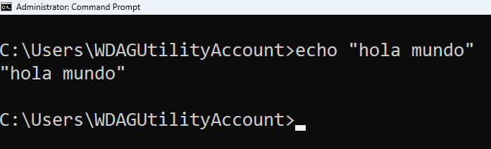

Antes de Empezar
---
<!-- pause -->
```console
           ⡴⠑⡄⠀⠀⠀⠀⠀⠀⠀ ⣀⣀⣤⣤⣤⣀⡀
           ⠸⡇⠀⠿⡀⠀⠀⠀⣀⡴⢿⣿⣿⣿⣿⣿⣿⣿⣷⣦⡀
           ⠀⠀⠀⠀⠑⢄⣠⠾⠁⣀⣄⡈⠙⣿⣿⣿⣿⣿⣿⣿⣿⣆
           ⠀⠀⠀⠀⢀⡀⠁⠀⠀⠈⠙⠛⠂⠈⣿⣿⣿⣿⣿⠿⡿⢿⣆
           ⠀⠀⠀⢀⡾⣁⣀⠀⠴⠂⠙⣗⡀⠀⢻⣿⣿⠭⢤⣴⣦⣤⣹⠀⠀⠀⢀⢴⣶⣆
           ⠀⠀⢀⣾⣿⣿⣿⣷⣮⣽⣾⣿⣥⣴⣿⣿⡿⢂⠔⢚⡿⢿⣿⣦⣴⣾⠸⣼⡿
           ⠀⢀⡞⠁⠙⠻⠿⠟⠉⠀⠛⢹⣿⣿⣿⣿⣿⣌⢤⣼⣿⣾⣿⡟⠉
           ⠀⣾⣷⣶⠇⠀⠀⣤⣄⣀⡀⠈⠻⣿⣿⣿⣿⣿⣿⣿⣿⣿⣿⡇
           ⠀⠉⠈⠉⠀⠀⢦⡈⢻⣿⣿⣿⣶⣶⣶⣶⣤⣽⡹⣿⣿⣿⣿⡇
           ⠀⠀⠀⠀⠀⠀⠀⠉⠲⣽⡻⢿⣿⣿⣿⣿⣿⣿⣷⣜⣿⣿⣿⡇
           ⠀⠀ ⠀⠀⠀⠀⠀⢸⣿⣿⣷⣶⣮⣭⣽⣿⣿⣿⣿⣿⣿⣿⠇
           ⠀⠀⠀⠀⠀⠀⣀⣀⣈⣿⣿⣿⣿⣿⣿⣿⣿⣿⣿⣿⣿⣿⠇
           ⠀⠀⠀⠀⠀⠀⢿⣿⣿⣿⣿⣿⣿⣿⣿⣿⣿⣿⣿⣿⣿⠃
```
<!-- pause -->
Hola, soy Jorge Thomas y esta es mi presentación "Domina la Terminal"
<!-- pause -->
# ¿Que aprenderás?
<!-- pause -->
* ¿Qué es la terminal, consola, shell y la linea de comandos?
<!-- pause -->
* ¿Por qué es importante aprender a usar la terminal?
<!-- pause -->
* Ejercicios prácticos para aprender a usar la terminal.
<!-- pause -->
* Impresionar a tus amigos con tu conocimiento de la terminal.
<!-- pause -->
* Juegos Interactivos para aprender sobre la terminal y programación.
<!-- pause -->
# ¿Qué necesitas?
* Una terminal (Windows: cmd, macOS: Terminal, Linux: Terminal) o un navegador web.
* Saber escribir.
* Ganas de aprender.
<!-- end_slide -->

Terminal, Consola, Shell y Línea de Comandos
---
<!-- column_layout: [2, 1] -->
<!-- column: 0 -->
# Consola:
Dispositivo físico o virtual para interacción. Ejemplos: Símbolo del sistema, PowerShell.
_También se usa de manera intercambiable con "terminal", pero a veces se asocia más específicamente con la interfaz que aparece al arrancar el sistema, antes de iniciar un entorno gráfico._
<!-- column: 1 -->

<!-- pause -->
<!-- reset_layout -->
<!-- column_layout: [2, 1] -->
<!-- column: 0 -->
# Terminal: 
Interfaz textuada para ejecutar comandos. Ejemplos: GNOME Terminal, macOS Terminal.
_Básicamente, es una ventana o un programa en el que puedes abrir y ejecutar sesiones de shell._
<!-- column: 1 -->

<!-- reset_layout -->
<!-- pause -->
<!-- column_layout: [2, 1] -->
<!-- column: 0 -->
# Shell: 
Intérprete de comandos que ejecuta y interpreta. Ejemplos: Bash, Zsh.
# Línea de Comandos:
Interfaz para ingresar comandos y recibir salida. Ejemplos: Comandos en cmd.exe, PowerShell.

_**Nota:** Todos son interfaces basadas en texto sin gráficos._
<!-- column: 1 -->


<!-- end_slide -->
¿Y a mi que me importa esto?
---
```console
           ⣞⢽⢪⢣⢣⢣⢫⡺⡵⣝⡮⣗⢷⢽⢽⢽⣮⡷⡽⣜⣜⢮⢺⣜⢷⢽⢝⡽⣝
          ⠸⡸⠜⠕⠕⠁⢁⢇⢏⢽⢺⣪⡳⡝⣎⣏⢯⢞⡿⣟⣷⣳⢯⡷⣽⢽⢯⣳⣫⠇
          ⠀⠀⢀⢀⢄⢬⢪⡪⡎⣆⡈⠚⠜⠕⠇⠗⠝⢕⢯⢫⣞⣯⣿⣻⡽⣏⢗⣗⠏⠀
          ⠀⠪⡪⡪⣪⢪⢺⢸⢢⢓⢆⢤⢀⠀⠀⠀⠀⠈⢊⢞⡾⣿⡯⣏⢮⠷⠁
          ⠀⠀⠀⠈⠊⠆⡃⠕⢕⢇⢇⢇⢇⢇⢏⢎⢎⢆⢄⠀⢑⣽⣿⢝⠲⠉
          ⠀⠀⠀⠀⠀⡿⠂⠠⠀⡇⢇⠕⢈⣀⠀⠁⠡⠣⡣⡫⣂⣿⠯⢪⠰⠂
          ⠀⠀⠀⠀⡦⡙⡂⢀⢤⢣⠣⡈⣾⡃⠠⠄⠀⡄⢱⣌⣶⢏⢊⠂
          ⠀⠀⠀⠀⢝⡲⣜⡮⡏⢎⢌⢂⠙⠢⠐⢀⢘⢵⣽⣿⡿⠁
          ⠀⠀⠀⠀⠨⣺⡺⡕⡕⡱⡑⡆⡕⡅⡕⡜⡼⢽⡻⠏
          ⠀⠀⠀⠀⣼⣳⣫⣾⣵⣗⡵⡱⡡⢣⢑⢕⢜⢕⡝⠀
          ⠀⠀⠀⣴⣿⣾⣿⣿⣿⡿⡽⡑⢌⠪⡢⡣⣣⡟
          ⠀⠀⠀⡟⡾⣿⢿⢿⢵⣽⣾⣼⣘⢸⢸⣞⡟
          ⠀⠀⠀⠀⠁⠇⠡⠩⡫⢿⣝⡻⡮⣒⢽⠋
```
<!-- pause -->
# Es importante porque:
<!-- pause -->
* Aprender a usar la terminal te hace más eficiente.
<!-- pause -->
* Te permite automatizar tareas.
<!-- pause -->
* Te da un mejor entendimiento de cómo funciona tu sistema operativo.
<!-- pause -->
* Te da una base sólida para aprender a programar.
<!-- pause -->
# La terminal nunca te va:
<!-- pause -->
* A fallar.
<!-- pause -->
* A mentir.
<!-- pause -->
* A engañar.
<!-- pause -->
* A traicionar.
<!-- end_slide -->

<!-- end_slide -->
¿En que lio me he metido yo?
---
<!-- pause -->
```console
           ⣿⣿⣿⣿⣿⣿⡿⣟⠻⠯⠭⠉⠛⠋⠉⠉⠛⠻⢿⣿⣿⣿⣿⣿⣿
           ⣿⣿⣿⣿⡽⠚⠉⠀⠀⠀⠀⠀⠀⠀⠀⣀⣀⣀⠀⠈⠙⢿⣿⣿⣿
           ⣿⣿⠏⠁⠀⠀⠀⠀⠀⠀⠀⠀⠀⢀⣾⣿⣿⣿⣷⣦⡀⠶⣿⣿⣿
           ⣿⡏⠀⠀⠀⠀⠀⠀⠀⠀⠀⠀⠀⣿⣿⣿⣿⣿⣿⣿⣿⡆⢻⣿⣿
           ⣿⠀⠀⠀⠀⠀⠀⠀⠀⠀⠀⠀⠀⣿⣿⣿⣿⣿⣤⣻⣿⣯⣤⣹⣿
           ⠁⠀⠀⠀⠀⠀⠀⠀⠀⠀⠀⠀⠀⠘⢿⣿⡇⠀⣿⢟⣿⡀⠟⢹⣿
           ⡄⠀⠀⠀⠀⠀⠀⠀⠀⠀⠀⠀⠀⠀⠀⢹⣷⣤⣤⣼⣿⣿⡄⢹⣿
           ⣷⠀⠀⠀⠶⠀⠀⠀⠀⠀⠀⠀⠀⠀⢠⣿⣿⣿⣿⣿⣿⠛⠉⠈⢻
           ⣿⣷⣄⠀⠀⠀⠀⠀⠀⠀⠀⠀⠀⠀⠀⠉⠛⠋⠛⠛⠛⠀⠀⣤⣾
           ⣿⣿⣿⣷⡀⠀⠀⠀⠀⠀⠀⠀⠀⠀⠀⠈⠉⠉⠉⠉⠛⠁⣰⣿⣿
           ⣿⣿⣿⣿⣿⣷⣦⣤⣤⣤⣤⣄⣀⣀⣀⣀⣀⣠⣤⣤⣤⣾⣿⣿⣿
```
<!-- pause -->
A continuación haremos unos ejercicios practicos para que puedas aprender a usar la terminal.
En ellos aprenderas:
<!-- pause -->
* A ejecutar comandos.
<!-- pause -->
* A navegar por el sistema de archivos.
<!-- pause -->
* A manipular archivos y directorios.
<!-- pause -->
* A buscar archivos y texto.
<!-- end_slide -->
'1. Hola Mundo'
---
# Comando Echo
El comando `echo` es un comando de la terminal que se utiliza para imprimir texto en la terminal.
<!-- pause -->
Nuestro primer desafío es imprimir "hello world" en la terminal con un solo comando.

_**Nota:** Hay muchas maneras de imprimir texto en la línea de comandos, una de ellas es con el comando 'echo'._
<!-- pause -->
# Paso a Paso
1. Abre tu terminal (Windows: cmd, macOS: Terminal, Linux: Terminal) o el sitio web: [](https://cmdchallenge.com/#/hello_world)
<!-- pause -->
2. Escribe el comando `echo` seguido de `"hello world"` y presiona Enter.



<!-- end_slide -->
'2. Directorio de Trabajo'
---
# Comando PWD
El comando `pwd` o `print working directory` es un comando de la terminal que se utiliza para imprimir el directorio de trabajo actual.
<!-- pause -->
Imprime el directorio de trabajo actual.
<!-- pause -->
# Paso a Paso
1. Abre tu terminal (Windows: cmd, macOS: Terminal, Linux: Terminal) o el sitio web: [](https://cmdchallenge.com/#/current_working_directory)
<!-- pause -->
2. Escribe el comando `pwd` (Windows CMD: `echo %cd%`) y presiona Enter.


<!-- end_slide -->
'3. Listar Archivos'
---
# Comando LS
El comando `ls` o `list` es un comando de la terminal que se utiliza para listar los archivos y directorios en el directorio de trabajo actual.
<!-- pause -->
Enumera los nombres de todos los archivos en el directorio actual, un archivo por línea.
<!-- pause -->
# Paso a Paso
1. Abre tu terminal (Windows: cmd, macOS: Terminal, Linux: Terminal) o el sitio web: [](https://cmdchallenge.com/#/list_files)
<!-- pause -->
2. Escribe el comando `ls` (Windows CMD: `dir`) y presiona Enter.


<!-- end_slide -->
'4. Limpiar la Terminal'
---
# Comando Clear
El comando `clear` es un comando de la terminal que se utiliza para limpiar la pantalla de la terminal.
<!-- pause -->
Limpia la pantalla de la terminal.
<!-- pause -->
# Paso a Paso
1. En tu terminal (Windows: cmd, macOS: Terminal, Linux: Terminal) escribe el comando `clear` (Windows CMD: `cls`) y presiona Enter.


<!-- end_slide -->
'5. Leer un Archivo'
---
# Comando Cat
El comando `cat` o `concatenate` es un comando de la terminal que se utiliza para leer archivos y mostrar su contenido en la terminal.

<!-- pause -->
# Paso a Paso

## Windows
1. Abre el explorador de windows y escribe en la barra de navegación `%userprofile%` y presiona Enter.
2. Te llevará a tu directorio de usuario, crea un nuevo archivo de texto llamado `hello.txt`.
3. En tu terminal (Windows: cmd) escribe el comando `type hello.txt` y presiona Enter.

## Navegador
1. Hay un archivo llamado access.log en el directorio actual. Imprime el contenido usando el comando `cat` seguido de `access.log`.


<!-- end_slide -->
'6. Últimas 5 Líneas'
---
# Comando Tail
El comando `tail` es un comando de la terminal que se utiliza para imprimir las últimas líneas de un archivo.
<!-- pause -->
Imprima las últimas 5 líneas de "access.log".
<!-- pause -->
# Paso a Paso
1. Abre el sitio web: [](https://cmdchallenge.com/#/last_lines)
<!-- pause -->
2. Escribe el comando `tail -n 5 access.log` y presiona Enter.


# ¿Que es esa N?
Habras notado que en tail estamos usando `-n 5`, esto es para indicarle a tail que imprima las últimas 5 líneas del archivo. `-n` es un argumento que se usa para especificar el número de líneas que se deben imprimir.
<!-- end_slide -->

Crea un archivo vacío llamado take-the-command-challenge en el directorio de trabajo actual.

<!-- end_slide -->

Crea un directorio llamado tmp/files en el directorio de trabajo actual

Sugerencia: El directorio "tmp/" no existe, con un solo comando debes crear tanto "tmp/" como "tmp/files"

<!-- end_slide -->

Copia el archivo llamado take-the-command-challenge al directorio tmp/files

<!-- end_slide -->

Mueva el archivo llamado take-the-command-challenge al directorio tmp/files

<!-- end_slide -->

Un enlace simbólico es un tipo de archivo que es una referencia a otro archivo.

Cree un enlace simbólico llamado take-the-command-challenge que apunte al archivo tmp/files/take-the-command-challenge.

<!-- end_slide -->

Elimina todos los archivos de este directorio de desafío, incluidos todos los subdirectorios y sus contenidos.

Sugerencia: hay archivos y directorios que comienzan con un punto ".", "rm -rf *" no funcionará aquí.

<!-- end_slide -->

En este desafío hay archivos con distintas extensiones. Elimine todos los archivos con la extensión .doc de forma recursiva en el directorio de trabajo actual.

<!-- end_slide -->

Hay un archivo llamado access.log en el directorio de trabajo actual. Imprima todas las líneas de este archivo que contengan la cadena "GET".

<!-- end_slide -->

Imprime todos los archivos en el directorio actual, uno por línea (no la ruta, solo el nombre del archivo) que contengan la cadena "500".

<!-- end_slide -->

Imprima las rutas de archivo relativas, una ruta por línea para todos los nombres de archivo que comiencen con "access.log" en el directorio actual.

<!-- end_slide -->

Imprima todas las líneas coincidentes (sin el nombre del archivo ni la ruta del archivo) en todos los archivos del directorio actual que comiencen con "access.log" y que contengan la cadena "500".

Tenga en cuenta que no hay archivos llamados access.log en el directorio actual, por lo que deberá realizar una búsqueda recursiva.

<!-- end_slide -->

Introduction slide
---

An introduction slide can be defined by using a front matter at the beginning of the markdown file:

```yaml
---
title: My presentation title
sub_title: An optional subtitle
author: Your name which will appear somewhere in the bottom
---
```

The slide's theme can also be configured in the front matter:

```yaml
---
theme:
  # Specify it by name for built-in themes
  name: my-favorite-theme

  # Otherwise specify the path for it
  path: /home/myself/themes/epic.yaml

  # Or override parts of the theme right here
  override:
    default:
      colors:
        foreground: white
---
```

<!-- end_slide -->

Headers
---

Using commonmark setext headers allows you to set titles for your slides (like seen above!):

```
Headers
---
```

# Other headers

All other header types are simply treated as headers within your slide.

## Subheaders
### And more

<!-- end_slide -->

Slide commands
---

Certain commands in the form of HTML comments can be used:

# Ending slides

In order to end a single slide, use:

```html
<!-- end_slide -->
```

# Creating pauses

Slides can be paused by using the `pause` command:

```html
<!-- pause -->
```

This allows you to:

<!-- pause -->
* Create suspense.
<!-- pause -->
* Have more interactive presentations.
<!-- pause -->
* Possibly more!

<!-- end_slide -->

Code highlighting
---

Code highlighting is enabled for code blocks that include the most commonly used programming languages:

```rust
// Rust
fn greet() -> &'static str {
    "hi mom"
}
```

```python
# Python
def greet() -> str:
    return "hi mom"
```

```cpp
// C++
string greet() {
    return "hi mom";
}
```

And many more!

<!-- end_slide -->

Dynamic code highlighting
---

Select specific subsets of lines to be highlighted dynamically as you move to the next slide. Optionally enable line
numbers to make it easier to specify which lines you're referring to!

```rust {1-4|6-10|all} +line_numbers
#[derive(Clone, Debug)]
struct Person {
    name: String,
}

impl Person {
    fn say_hello(&self) {
        println!("hello, I'm {}", self.name)
    }
}
```

<!-- end_slide -->

Snippet execution
---

Code snippets can be executed:

* For various languages, including compiled ones.
* Their output is shown in real time.
* Unimportant lines can be hidden so they don't clutter what you're trying to convey.
* By default by pressing `<ctrl-e>`.

```rust +exec
# use std::thread::sleep;
# use std::time::Duration;
fn main() {
    let names = ["Alice", "Bob", "Eve", "Mallory", "Trent"];
    for name in names {
        println!("Hi {name}!");
        sleep(Duration::from_millis(500));
    }
}
```

<!-- end_slide -->

Images
---

Image rendering is supported as long as you're using iterm2, your terminal supports
the kitty graphics protocol (such as the kitty terminal itself!), or the sixel format.

* Include images in your slides by using ``.
* Images will be rendered in **their original size**.
    * If they're too big they will be scaled down to fit the screen.


_Picture by Alexis Bailey / CC BY-NC 4.0_

<!-- end_slide -->

Column layouts
---

<!-- column_layout: [2, 1] -->

<!-- column: 0 -->

Column layouts let you organize content into columns.

Here you can place code:

```rust
fn potato() -> u32 {
    42
}
```

Plus pretty much anything else:
* Bullet points.
* Images.
* _more_!

<!-- column: 1 -->


_Picture by Alexis Bailey / CC BY-NC 4.0_

<!-- reset_layout -->

Because we just reset the layout, this text is now below both of the columns. Code and any other element will now look
like it usually does:

```python
print("Hello world!")
```

<!-- end_slide -->

Text formatting
---

Text formatting works as expected:

* **This is bold text**.
* _This is italics_.
* **This is bold _and this is bold and italic_**.
* ~This is strikethrough text.~
* Inline code `is also supported`.
* Links look like this [](https://example.com/)

<!-- end_slide -->

Other elements
---

Other elements supported are:

# Tables

| Name | Taste |
| ------ | ------ |
| Potato | Great |
| Carrot | Yuck |

# Block quotes

> Lorem ipsum dolor sit amet. Eos laudantium animi ut ipsam beataeet
> et exercitationem deleniti et quia maiores a cumque enim et
> aspernatur nesciunt sed adipisci quis.

# Thematic breaks

A horizontal line by using `---`.

---

<!-- end_slide -->

Herramientas Usadas
---

Entre las herramientas usadas para la creación de esta presentación se encuentran:

* [presenterm](https://github.com/mfontanini/presenterm) - Herramienta de presentaciones en terminal.
* [wezterm](https://github.com/wez/wezterm) - Emulador de terminal y multiplexor.
* [carnac](https://github.com/Code52/carnac) - Herramienta de grabación de teclado.
* [cmdchallenge](https://cmdchallenge.com/) - Juego interactivo para aprender comandos de terminal.
* [bitburner](https://bitburner-official.github.io/) - Juego de simulación de hacking.


https://overthewire.org/wargames/bandit/bandit0.html
